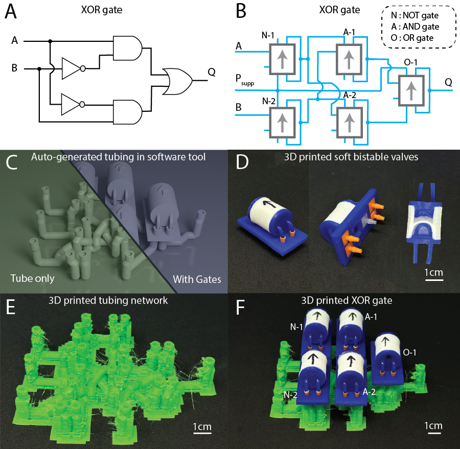
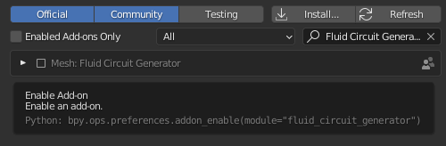
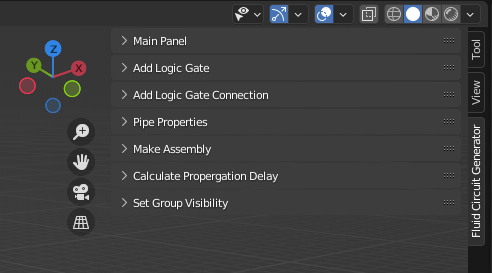

# Fluid Circuit Generator

This project is a Blender addon tool to help design Fluidic Networks.

The software is designed to be part of a workflow for the fabrication of macro-fluidic circuits. 
Where instead of manually wiring logic components, designers can feed their design into the software and generate the connections as a 3D printable fluidic network model.
The logic components can be put onto the network to form a functional fluidic circuit. (shown below)

A video tutorial for using the software can be found
[here](https://youtu.be/gbxtxueENJk).

## Requirements

* [Blender version 3.2](https://download.blender.org/release/Blender3.2/)

## Installation

* Download this repository. 
  * What you need is the fluid_circuit_generator.zip file inside the repository folder. You can discard the rest.
  * DO NOT unzip the file. Blender will automatically extract the contents when it installs add-ons.
* In Blender, go to Edit -> Preferences -> Add-ons
  * This window manages the addons installed in your Blender
* Click the install button on the top of this popup window, navigate to the fluid_circuit_generator.zip file and click Install Add-on.
* The installed add-on should be shown. Enable the add-on by checking the check box. By this point, you should be able to start using the Fluid Circuit Generator.

* At this point, a new tab should appear on the sidebar. If you don't see a sidebar, press "N".

## User Mannul

### Basic Usecase

1. In the Main Panel, press the "Reset Addon" button after each finalized assembly is generated and before you create a new one. This deletes everything.
2. In the Add Component Panel, you can add a component for your circuit. Select the component you want to add and press the "Add Object" Button.
    * Within the addon, we also provide a component library that is fully 3D printable with desktop FDM printers. (We use Prusa MK3S)
    * Library consists of:
      * Mono stable valve can be configured as AND, OR, NOT, INHIBIT logic gates. (refer to our paper)
      * Bi-stable valve, which can be used as non-volatile memory.
      * Free ends, which are place holders for open ends to atomosphere pressure
    * Designers can also create their own circuit components following the "Creating Custom Circuit Components" part of the mannual.
    * You can move, rotate and scale the selected object with this panel. You can also use default Blender operations to manuver the objects. There is a simple cheat sheet of basic Blender operations below.
3. In the Add Connection Panel, you can add connections between components.
    * Choose the component object with the eyedrop or drop down. Choose the port if applicable. Click again to deselect port. 
    If a connection point is selected correctly, a hollow sphere will appear at the point of selection.
    * Every row is a connection. To delete a connection, cross out both selections on that row.
4. In the Tubing Properties Panel, you can costumize your tubing.
    * The default values in the software matches with our actrual circuit element and our experiement. But feel free to change them if you want.
    * First column is the basic properties. Unit length means the resolution / density of tubing routing. 
      * Usually you don't need to adjust this. Larger unit length gives you faster performance and premits larger tubing diameter. However, it could also cause the system to not be able to route dense tubing.
    * Second column if enabled adds a staging block under each logic gate conponent.
    * Third column adds a costum tip to each tip of the tubing. 
      * Costum tip is appended to the very top of the tubing, and offset moves the costum tip down
      * To make your own costum tip, refer to the sample costum tip in the Gate_Library folder in the zip file.
    * After you adjust the properties, press the Make Preview Tubing button to make a preview.

5. Controlling fluidic circuit with obstacles.
    * During the fluidic circuit design process, users can gain greater control over tube routing by utilizing STREAM’s obstacle avoidance feature. Any geometry added to the design prior to assembly generation is treated as an obstacle, and the routing algorithm ensures that the resulting tubing paths do not intersect with these volumes. This capability enables the co-design of structural and fluidic elements, making it possible to create mono-printed robots where both the mechanical structure and internal tubing are fabricated in a single print.

5. In the Generate Assembly Panel, you check your connections and make the final module
    * Press the Preview Conneciton button to visualize the connections you made. You can still edit your connection in this step. Preview is refreshed after you hide the preview.
    * If everything looks correct, click Confirm Changes
    * WARNING: The Generate Assembly operation is NOT reversible! Please make sure everything looks correct before you generate the final module.
    * NOTE: Ctrl+Z won't redo the changes correctly, and will cause wield errors.
    * If the final module is not what you want, you NEED to start over by pressing the Reset Addon Button at the top.
    * If you press the Generate Assembly button and an error message pop up, please read the error message and make changes accordingly. 
6. In the Calculate Propergation Delay Panel, you can calculate theoretical propergation delay in the system.
    * This panel is only functional once you generate the final module.
    * Select the port in the same way you choose the connections.
7. In the Set Group Visibility Panel, you can hide part of the final module.
    * It's mostly for convinience when you want to export the final module.
    * To export the final module, use this panel to hide thing you don't want to export.
      * Press "A" to select all visible objects.
      * Go to File -> Export -> Stl
      * Remember to check the Selection Only on the right of the popup window.
      * Choose your export location and export.

### Scripting Support
The software have a hidden layer of API that supports scripting.
Basically, user can provide a script to automate the design process described above.
The software can also generate a script based on your design / changes.

The "Save Current Progress" button inside the "Main Panel" will generate the script that acptures all the status of the tool.
However, only models imported with the "Add Object" button will be saved.
The script generated is a .json file, with the attributes of objects created by the software stored inside.

The "Load Saved Progress" button will load the selected file into the software, which will parse the file and automatically excicute a set of commands saved inside the script file.

This functionality enables users to share designs, reduce repetitive work and even perform version control on their design.

However, the feature is most useful for the designer to iterate their design. 
Since the software will erase all changes after generating the final tubings, saving a script before generation of tube would result in a more smooth work flow.

### Creating Custom Circuit Components
Logic Gates needs to have a stl file and a json file with the same name. Use the provided Circuit library as template and change values in each field.
Detailed instructions are available on our paper (TODO, which will come out later this year)

### Fabricating our Logic Components
The details of the 3D model, printing parameters, and assembly guide can be found in the "keep-everything" branch of this repo. Detailed instructions is availabe in our [Github](https://github.com/roboticmaterialsgroup/3D-printed-valve) and [paper](https://arxiv.org/abs/2312.01131).

### Designing Monolithic Printed Robot
One of the goals for this research is to enable automated design and fabrication of custom-built robots. This vision has recently become more attainable due to development of FDM printable monolithically pneumatic logic gates by [Conrad et al.](https://www.science.org/doi/10.1126/scirobotics.adh4060) This design enable us to print tubing together with logic elements, enabling a fluidic circuit that can work directly off the print bed with no manual labor involved. 
* Design tip: These logic elements are intricate and typically print successfully only when placed directly on the print bed. However, STREAM automatically routes tubing beneath logic components, which can interfere with print quality. As a workaround, we recommend designing circuits with the logic elements oriented upside-down and then flipping the final design before printing. For convenience, we include a pre-flipped version of the logic gate design in our valve library as "sci_gate.stl".

### Debugging Guides

There are several common types of bugs:
1. Stuff not selected properly
    * Just go over the UI and examine if everything is properly selected.

2. Port position not valid:
    * Error message will say: "... is not in the first coordinate ..." or "... is too close to ground ..."
    * This is caused by a port location is less than a unit away from groung, which will result in errors later.
    So the software just throws an error when it detects that.
    * To fix it, just move the vialating circuit component up.

3. Path for some connection is not found

    * Debugging can be done by bring up blender consol window.
    * Look for "ERROR" in the print. Most possibly, it will say "Error: Can't retreve whole path ..." or "ERROR: Path [...] is too short to be joined by ..."
    * This means that there are too many connections to one port and there are no place to add more connections.
    * Solusion is to assign some of the connections to other ports. eg. A->B & A->C could be changed to A->B->C
      * This error is because when the software joins a tube to existing tube, the existing on will be devided into two. If you add too many connections to one port, it will run out of length to be joined to, which results in the error "Path [...] is too short to be joined by ..."

### Design Principles for Better Quality Fluidic Networks

1. Try to aviod having more than two connections to one output. 
    * Discouraged: A->B, A->C, A->D, A->E
    * Encouraged: A->B, B->C, C->D, D->E
2. The minium height for ports are recomended to be 2 * unit + 1.
    * eg. with software presets, unit=7, a good port height will be 15.
3. It's generally a good idea to have all the components at around the same height.
4. Keep some spacing between components because eventrually you need to assemble them, and they need to fit physically.
5. For design examples, refer to the "keep-everything" branch of the repo, a few well-structured examples of circuit design is available.

## Blender Operation Cheat Sheet

| Key | Description |
|---|---|
| A | Select all visible objects |
| X | Delete selected object |
| N | Show/Hide side bar |
| G | Grab/Move selected object |
| R | Rotate selected object |
| S | Scale selected object |
| Tab | Object/Edit mode |

For more detailed information on Blender Hotkeys, visit this 
[website](https://www.dummies.com/article/technology/software/animation-software/blender/blender-for-dummies-cheat-sheet-208646/).

